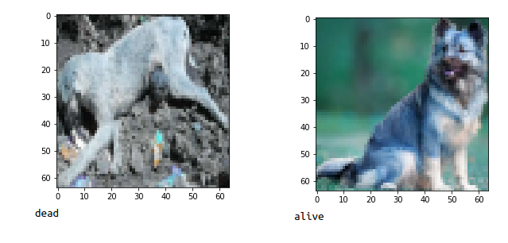

# Dog-Dead-or-alive-detection-CNN-Keras
The CNN model that classifies the dog images as dead or alive.

 

# Dataset

You can use pretrained model or train your own. 
If you want to train you should download the dataset.

Dataset contains 200 images per each class. You can download from links below. Just exract them into directory of resnet.py.

https://drive.google.com/open?id=1ZCAwGpDk7UPeqH8gZ2y-BCCucJ97HdRA --(Live dog images) ~37mb
https://drive.google.com/open?id=1FvFkaU0wYGTj3kjTCnc76YVx_xty8qsw --(Dead dog images) ~19mb
Ps: I'm still collecting images from internet. I'm going to re-upload the dataset periodicly.

# Architecture

I use "implamentation a ResNet in Keras" where shown in this video.
https://www.youtube.com/watch?v=qMFKsMeE6fM

 
